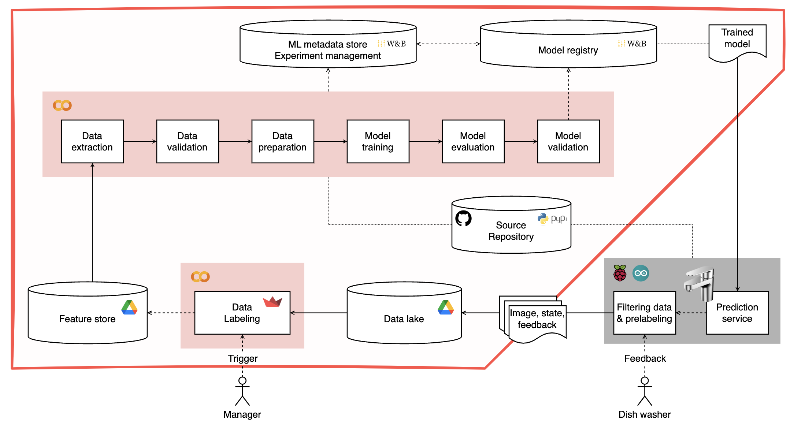
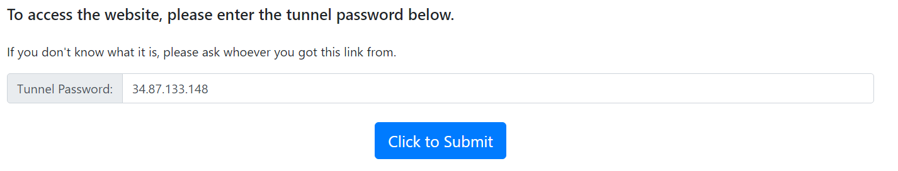
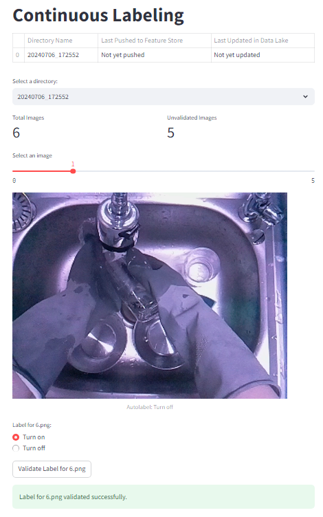
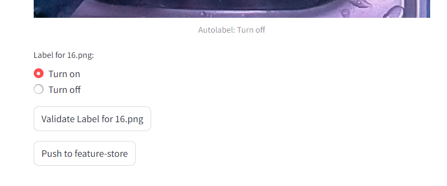
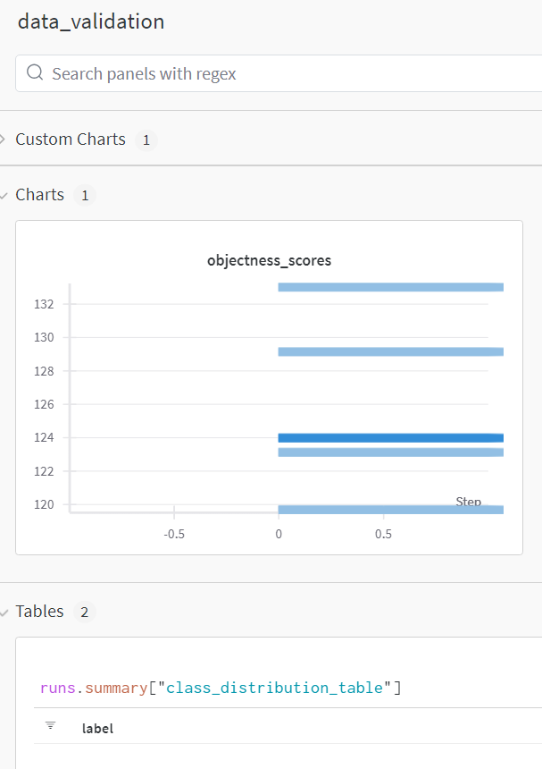

# autosink-orchestra

## About Autosink Project

매년 주방에서 팔당댐을 세 번 채울 수 있을 만큼의 물이 낭비됩니다. 설거지 중 물을 틀어놓고 접시를 선반에 오르내리는 시간은 전체 설거지 시간의 10% 를 상회합니다. 이 프로젝트는 설거지할 때 낭비되는 물의 양을 줄이기 위해 컴퓨터 비전 기술과 사용자의 피드백을 활용하여 재학습되는 인공지능(MLOps)기술을 활용하여 자동 싱크대 수전 제어 시스템을 구축하는 것을 목표로 합니다. 라즈베리파이와 연결된 카메라를 통해 실시간으로 설거지 상황을 인식하고, 학습된 AI 모델의 판단에 따라 솔레노이드 밸브를 제어하여 물 공급을 자동으로 조절합니다. 사용자의 수도꼭지 직접 조작 등의 피드백을 수집하여 모델 업데이트에 활용하여 사용자의 설거지 패턴에 최적화된 물 절약 성능을 제공합니다.

## 이 저장소가 다루는 내용



이 저장소는 전체 MLOps 파이프라인 중 재학습을 위한 전체 파이프라인을 관리하는 통합 저장소입니다. 이 저장소는 재학습 파이프라인의 각 구성을 담당하는 하위 레포지토리와 전체 파이프라인 실행코드 pipeline.ipynb를 포함하고 있습니다. 이 외 싱크대를 제어하는 라즈베리파이의 사용 부분에 관해서는 [다음 저장소](https://github.com/slink-to-unlock/rpi-snailshell)를 참고하세요.

## 개별 구성요소별 설명

각 레포지토리는 다음과 같은 역할을 수행합니다.

- `autosink-data-elt`: autosink에서 사용되는 모든 데이터의 format이 있는 저장소.
- `sparse-to-dense`: 피드백 데이터셋 레이블링을 담당하는 저장소. Data lake로 들어온 원천데이터들을 레이블링하여 Feature store로 업로드하는데 사용됩니다.
- `autosink-model-training`: Model training 및 Model evaluation을 담당하는 저장소. 모델을 학습하고 Wandb에 학습 로그 기록 및 모델 아티팩트 업로드하는데 사용됩니다.
- `autosink-model-validation`: Model validation을 담당하는 저장소. 재학습된 모델을 분석하고 상황별로 평가하는데 사용됩니다.

## 빠른 시작

[](https://colab.research.google.com/github/slink-to-unlock/autosink-orchestra/blob/main/notebooks/pipeline.ipynb)

### wandb 준비

- wandb API key와 entity가 필요합니다.

### google drive 준비

- 제공하는 것
    - base model 압축 파일: 재학습 시 pretrained weight로 사용됩니다.
    - Data lake 예제 압축 파일: 예제 데이터셋은 피드백을 받은 상황에서 발생한 데이터입니다.
- base model과 Data lake를 구글 드라이브에 업로드합니다.

### 환경세팅: Install Requirements

- 전체 파이프라인을 구성하는 저장소들을 불러옵니다.

### 학습용 데이터 추출: Data Extraction

- AutosinkPath를 본인 구글드라이브 경로에 맞게 수정합니다.
    
    ```python
    path = AutosinkPath(
        data_lake_rel_dir=os.path.join('dev','autowash', 'data', 'data-lake'),
        feature_store_rel_dir=os.path.join('dev','autowash', 'data', 'feature-store', 'train'),
    )
    ```
    
- 피드백 데이터셋 레이블링은 다음의 과정으로 진행합니다.
    - ‘yorl url’ 들어가서 My IP(Password) 입력합니다.
        
        
        
    - human_in_the_loop에서 레이블 검수 및 수정을 진행합니다.
        - directory와 image를 선택한 후 새로운 레이블을 지정한 후 아래 버튼을 클릭합니다.
            
            
            
        - 완료된 폴더는 feature-store로 추출합니다.
            
            
            

### 재학습 실행: Data Preparation, Data validation, Model Training, Model Evaluation, Model Validation

- Data validation
    - W&B 설정
        
        ```python
        # W&B 설정
        run = wandb.init(project="AIsink-resnet50", name="data_validation", entitiy="your_wandb_entity")
        ```
        
    - 데이터분석: 객체성 스코어 및 레이블 분포표
    
    
    
- Model validation
    - case validation dataset 경로 수정
        
        ```python
        outputs_list = []
        case_root = 'path to case_validation_dataset'
        print('case folder root:', case_root)
        ```
        

## 컨트리뷰션

소스코드 자체에 부족한 점이 매우 많음을 양해해 주세요. 프로젝트 개선과 적극적인 기여는 언제나 환영입니다. 문의가 있는 경우 이슈를 남겨주세요.
